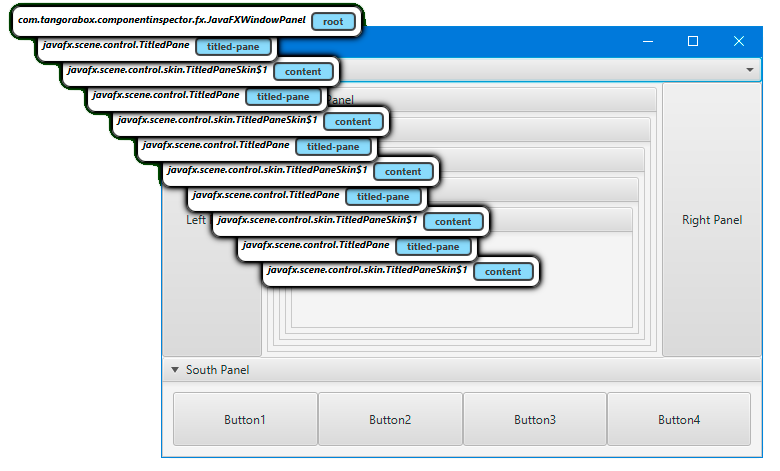
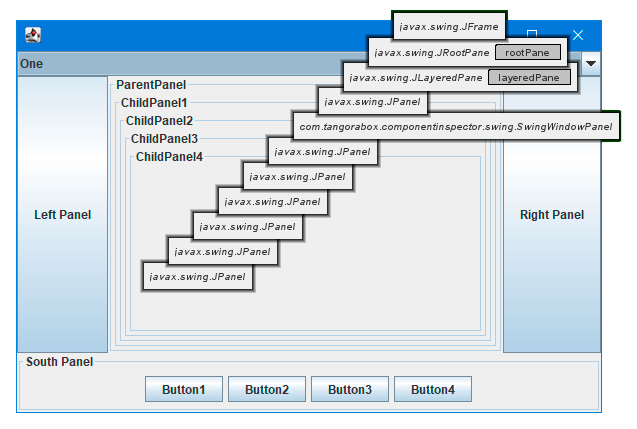
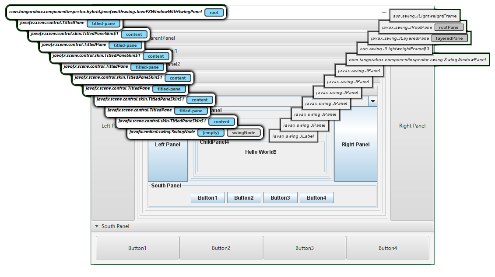
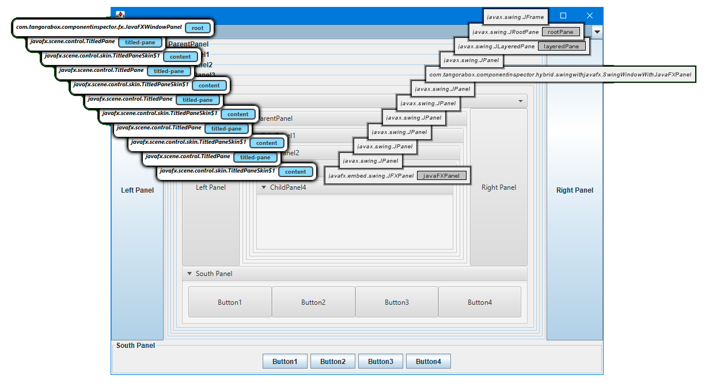

# Java Desktop (JavaFX and Swing) Component Inspector

> A Tool for help you to inspect the location and properties of certain components in a window hierarchy

[](https://opensource.org/licenses/LGPL-3.0)
[](https://travis-ci.com/TangoraBox/ComponentInspector)
[](https://sonarcloud.io/dashboard?id=com.tangorabox%3Acomponent-inspector)

***JavaFX Component Inspector***

[]()

***Swing Component Inspector***

[]()

***Swing inside JavaFX***

[]()

***JavaFX inside Swing***

[]()

***Example Demo***


---

## Java FX Example

```java
FXComponentInspectorHandler.handleAll();
```

## Swing Example

```java
SwingComponentInspectorHandler.handleAll();
```

---

## Installation with Maven

The artifacts have been published to maven central


### FXComponentInspector

***Java 11+***

```xml
<dependency>
    <groupId>com.tangorabox</groupId>
    <artifactId>component-inspector-fx</artifactId>
    <version>1.1.0</version>
</dependency>
```

***Java 8***

```xml
<dependency>
    <groupId>com.tangorabox</groupId>
    <artifactId>component-inspector-fx</artifactId>
    <version>1.1.0-java8</version>
</dependency>
```

---

### SwingComponentInspector

***Java 11+***

```xml
<dependency>
    <groupId>com.tangorabox</groupId>
    <artifactId>component-inspector-swing</artifactId>
    <version>1.1.0</version>
</dependency>
```

***Java 8***

```xml
<dependency>
    <groupId>com.tangorabox</groupId>
    <artifactId>component-inspector-swing</artifactId>
    <version>1.1.0-java8</version>
</dependency>
```

---

## Features

- CSS class name in javafx node components []()
- Field name of component declaration in parent (when possible) []()
- The inspected component is highlighted _(since v1.0.3)_

## Usage 

> The inspector window is only shown if you hold down the CONTROL key when you move the mouse

---

## Contributing

> If you want to contribute to upgrade this project with new features or fixing bugs, you're welcome, please make a pull request.

---

## Team


| <a href="https://github.com/garzy" target="_blank">**GaRzY**</a> | 
| :---: 
| [](https://github.com/garzy)   
| <a href="https://github.com/garzy" target="_blank">`github.com/garzy`</a> | 


---

## Support

Reach out to me at one of the following places!

- Mail to [info@tangorabox.com](mailto:info@tangorabox.com)
- Twitter at <a href="http://twitter.com/garzydj" target="_blank">`@garzydj`</a>

---


## License

[](https://opensource.org/licenses/LGPL-3.0)
